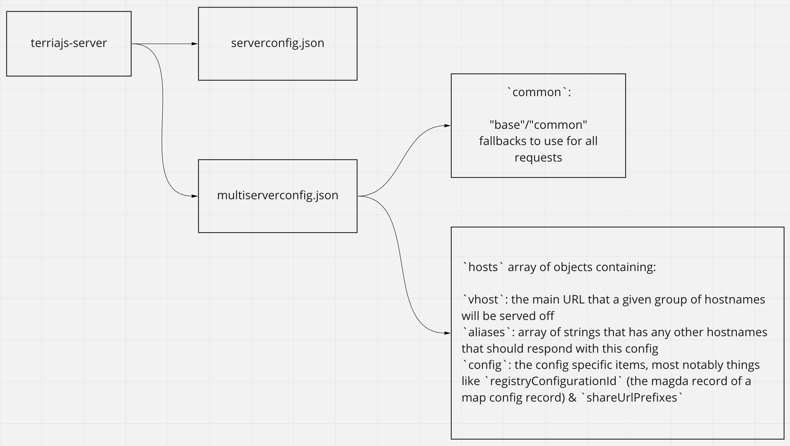
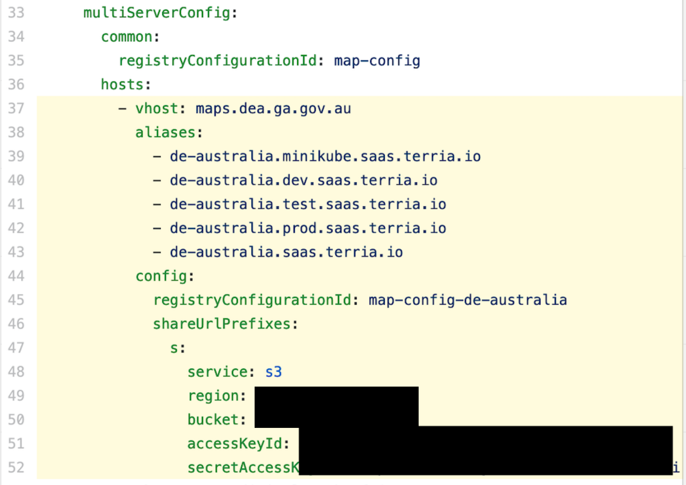

# 1. Multi tenancy

Date: 2020-11-08

## Status

Proposed

## Context

Putting this here in proposed state, as I don't know what the state of the
multi-tenancy PR will become. terriajs-server should include some way to allow
multiple runtime configuration, varying on the host that a given request is
coming from.

terriajs-server runs on a branch (multi-tenant-merged) that is still PR-ed, from
initially its own branch (multi-tenant), but pulled in the TypeScript changes
that have since been merged into master. Hence the branch name.

## Decision

Build out multi tenancy in terriajs-server

## Consequences
